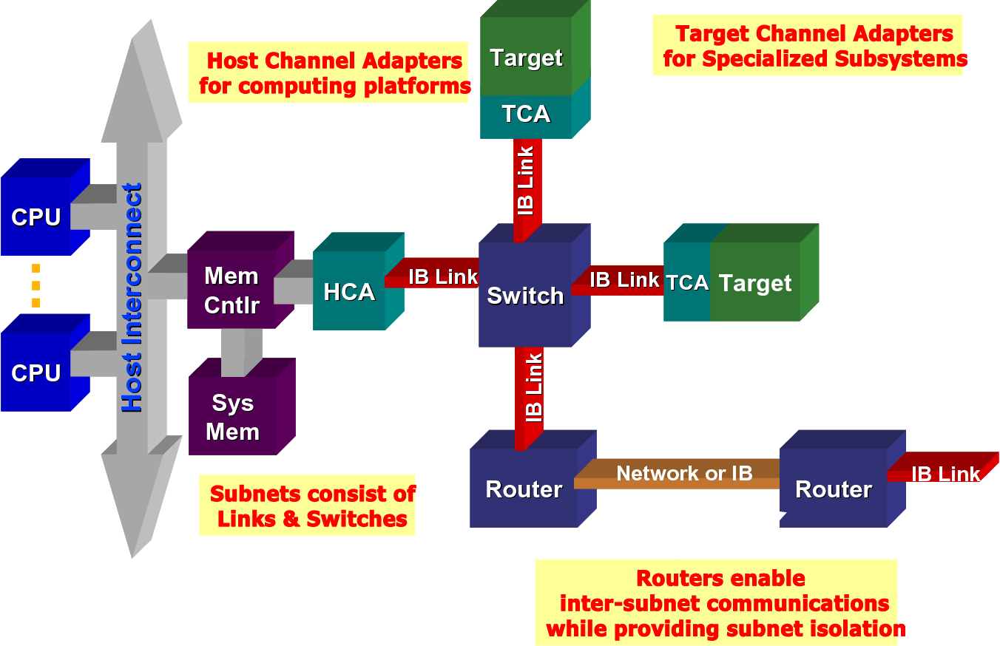
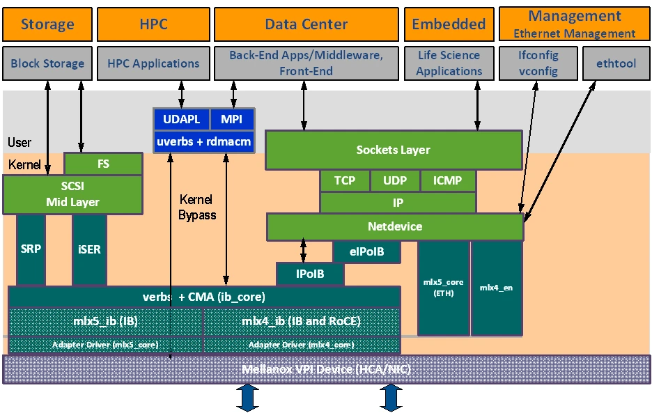
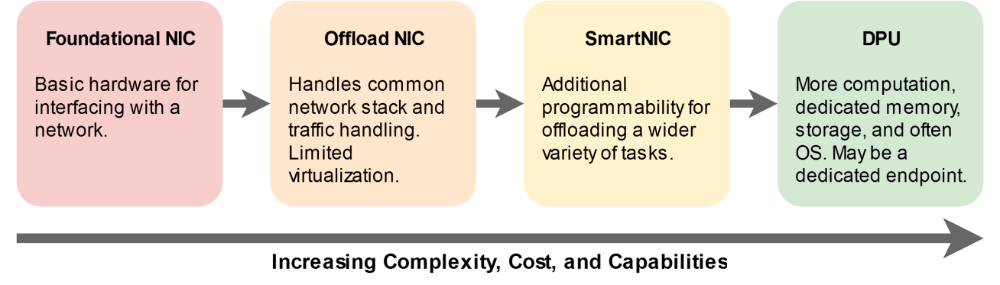
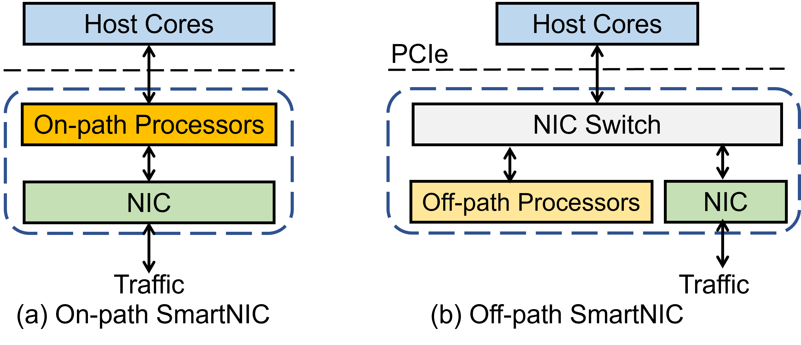
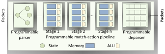
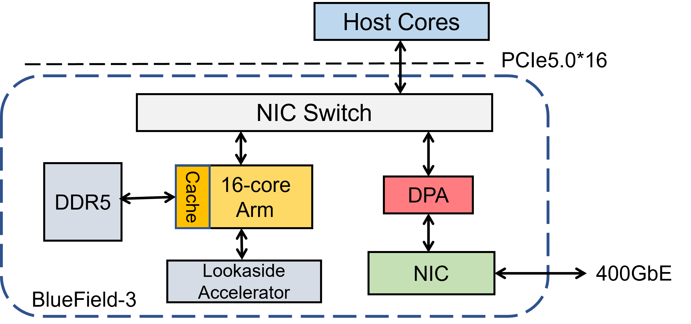
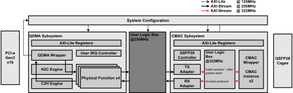
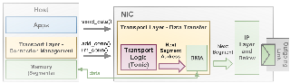
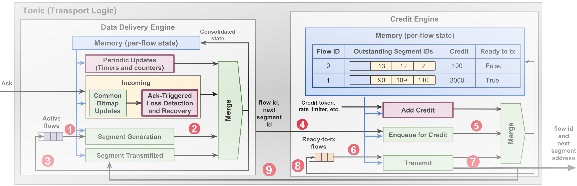
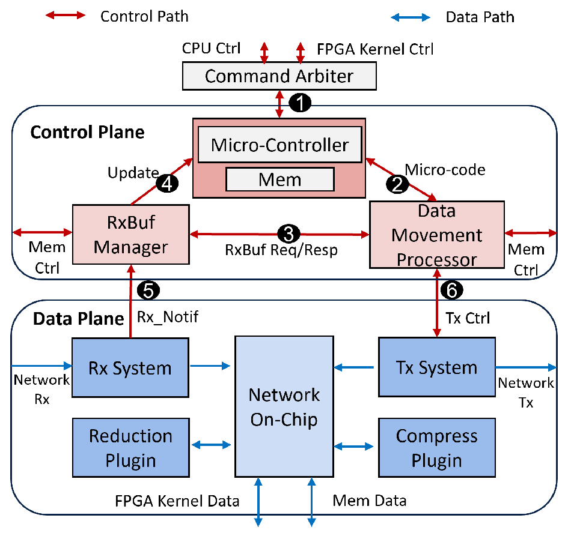

# Chapter 1: Introduction

## New Era of Network

随着计算机应用程序的发展，催生出了众多新的模式，这些趋势要求着计算机系统的与时俱进发展以适应新的计算形态。

#### 高性能网络
1. 随着互联网进入高速发展阶段，线上业务和用户规模的不断增加，给计算机系统的承载能力带来了很大挑战。IO 总线性能进展缓慢，成为了系统瓶颈。    
为了满足性能需求，数据中心搭载了大量计算机组成的集群，数据中心内和数据中心间需要高性能网络以满足集群间计算机通讯的需要，计算机系统总线向外衍生。
 - SDN: 在数据中心网络中，通过一个集中式的控制器以标准化的接口对各种网络设备通过软件进行管理和配置，从而简化网络资源的设计、管理和使用。具有上帝视角的控制器可以统筹管理网络流量实现负载均衡、安全策略等。
  
1. `InfiniBand` 支持高速低延迟的互联。然而，随着以太网的蓬勃发展，为了避免在数据中心构建两套网络的负担，人们转向通过以太网承载这些功能(e.g. `RoCE`, `NVMe over RoCE`)。

 - RDMA: 在高性能计算和数据中心网络领域，通常使用 RDMA 技术以完成科学计算、数据库、存储等负载。用户空间程序之间直接完成对对方远端内存的 `Read`/`Write`/`Atomic` 操作, 内核态只需要管理连接和硬件状态。
 - DPDK: 将传统的网卡收到数据包通过内核态处理的流程(例如 TCP/IP 协议栈)完全转移到了用户态处理，用户空间通过 VFIO 直接操纵网卡硬件(类似于用户空间网卡驱动)，减少了 CPU 处理中断和上下文切换的额外开销，从而能够使 CPU 得到更高效的利用，可实现对各类传统网络(广域网)应用的加速, e.g. `dpdk-nginx`(HTTP)。

#### 云计算
互联网已经成为基础设施，用户可以随时订阅一些云计算资源，数据中心灵活地按需提供给用户包括计算、存储、网络、数据库等算力形态。
 - 网络加速: 虚拟机网络虚拟化，硬件的网卡需要虚拟化为无数个虚拟的逻辑网卡接入到一个个虚拟机，并为这些虚拟的逻辑网卡接入到相应的网络，完成对网络交换和管理功能的硬件卸载。

 
 - 存储虚拟化: 云计算厂商将存储集中池化, 计算节点通过网络远程访问存储池(如 NVME-oF)，以实现集中管理和分配，具有更高的灵活性和扩展性。需要硬件卸载以减少 CPU 开销。

#### 流量管理与加密
1. 随着网络请求的日益增加，对网络流量的管理需求受到关注，如 DDoS 防护、负载均衡和流量过滤。高网络流量对系统性能提出了挑战。
- eXpress Data Path(XDP) 运行在比传统 Linux 网络组件更低的层级，通过将 eBPF 程序直接附加到网络设备驱动程序上，在数据包被内核标准网络栈处理之前拦截并处理它们，从而实现了极低延迟和高效的数据包处理。
- 将这些 eBPF 程序直接下沉卸载到智能网卡，可实现高效的硬件加速。

2. VPN 隧道技术(如 WireGuard, IPSec 等): 通过加密实现了广域网的私密通道，保护传输的信息不被拦截和未经授权的访问，从而实现广域网上构建一套虚拟的安全可信私网，可满足用户对企业、校园等组织的内部私有设施的访问。  
3. ZeroTrust 零信任模式(内网穿透): 通过在代理主机和服务器之间构建私密隧道，可对所需组织内部设施广域网暴露和互相隔离。相比于传统的 VPN 和防火墙技术信任安全私网"城堡"内的所有人和设备，Zero Trust 不信任任何人，并且试图访问网络资源的每一个人都需要通过代理主机并经过验证。
- 隧道的加密解密算法与封包/解包需要大量算力，而硬件智能网卡处理芯片的硬化逻辑具有强大的处理能力。

## Category of Architecture
智能网卡的体系结构发展也经历了如同 GPU 一样的: 从固定管线、可编程管线，到异构计算系统的过程。

#### 基础 NIC
仅负责将物理层的光/电信号转换为数字信号，通过 PCIe 传给 CPU。
 - 所有的功能(如协议栈、校验码计算)都由 host CPU 处理。
 - 随后诞生了将一些特定的网络功能卸载到网卡硬件中，如 TSO、Checksum offload、LSO/LRO (分段/重组)等。
 - 进入 10Gbps 时代后, CPU 处理网络包的开销逐渐变得不可接受。

#### 卸载 NIC
配备了一些略复杂的功能(如网卡虚拟化与 OvS，存储加速等)，应用可以对功能进行一些简单的管理。
 - 网卡以 ASIC 架构为主，结构简单性能高。网络协议和功能固化，基本没什么编程能力。
 - `One size never fits all.` 采用软件定义的方法能够推动针对场景的网络快速开发、部署与优化，而 ASIC 的长开发周期无法适应软件定义网络（SDN）快速变化的需求。
 
#### 独立可编程智能网卡
 - 所有的基础设施任务（网络、存储、安全、SDN）全部从 Host CPU 剥离并运行于网卡上。
 - 搭载的 FPGA 允许用户编程数据平面的处理逻辑, 如实现 Crypto(e.g. SSL/TLS, SHA)/Compression(e.g. GZIP)/RAID/... 等较为复杂功能的卸载。
 - 网卡中数据包处理逻辑通常不是最大的消耗部分。相反, 资源大小通常由 SRAM 构建的 Buffer, 收发器和驱动这些接口的逻辑(如以太网 MAC + PCS, PCIe 控制器、DRAM 控制器)控制。
 - 只要有足够的时间、精力和专业知识，几乎可以在 FPGA 上可用的门电路范围内高效实现任何功能。然而，FPGA 以编程难度大和成本高而著称，需要花费非常多的人力和时间。
> FPGA 开发的 10/100/1000 准则: 10 years workload; no more than 100 lines; at least 1000 machines;
  
#### Soc可编程智能网卡
 - 通过集成 ASIC / FPGA 和 CPU 为此提供了一种平衡的解决方案。SoC 方案集成了独立的内存和存储组件，有的还配备了丰富的硬化加速器，可以高效地支持更为复杂的网内计算功能。

  

#### 概览
| Architecture | Cost | Programmable | Flexibility | Performance | Product |
|:------------:|:----:|:------------:|:-----------:|:-----------:|:-------:|
| None(Basic) | Cheap | Low | Low | Low | Intel 82599 |
| ASIC | Low | Low | Low | High | Mellanox ConnectX-5 |
| FPGA | High | High | Medium | High | Achronix, Xilinx Alevo U50, Cisco Nexus, Alibaba CIPU, Microsoft Catapult |
| ASIC + FPGA | High | Medium | Medium | High | Mellanox Innova-2 Flex |
| CPU + FPGA | High | High | High | Medium | Xilinx Alveo U25N, Intel SmartNIC N6000 |
| CPU + ASIC | Medium | Low | High | Medium | Pensando, NVIDIA BlueField, Netronome Agilio, Intel IPU(Google), Broadcom Stingray... |

## Category of Mechanism

#### On-Path SmartNICs
为了在硬件上实现高效的逐包 Match-Action，并充分利用流水技术和并行以提升速度，提出了RMT(Reconfigurable Match Tables)。  
网卡会根据匹配表匹配和调度，将包分配至核心(或经由可编程流水线)，按照匹配的动作处理沿通信路径传播的每个数据包。
 - On-Path 可支持实现最新的拥塞控制算法和网络协议，也可以实现对传统网络的卸载(e.g. TOE)。
 - 如果微码程序本体过大或执行时间过长，可能会导致发送到主机的常规网络请求性能显著下降。
 - 由于使用了低级 API，编程具有挑战性。(e.g. 1000+ pages of documents)

#### Off-Path SmartNICs
在数据平面旁集成大型计算核心和内存，并运行通用操作系统(如 Linux)。卸载的代码置于网络处理流水线的关键路径之外。核心通过专用接口与网卡核心和主机相连，通过网卡上嵌入式交换机的转发规则将需要操作的流量转发至核心进行处理。
 - 支持完整内核和网络协议栈，支持复杂的卸载操作，编程复杂度低, 对主机的影响较低。
 - 相比 On-Path 引入了较高额外的延迟，逐包处理性能不佳。
#### 混合方案
通过同时集成 Off-Path 的少数大型 CPU 核心和 On-Path 的大量包处理小核的异构架构以同时支持不同复杂度的加速功能。
- 快路径经由 On-Path 处理器，用于处理简单高性能的逻辑
- 慢路径经由 Off-Path 处理器(以及 DSA 专用加速器)，用于处理较为复杂的逻辑

> 为什么慢路径不可以直接发送至 host CPU 经由 OS/DPDK 协议栈处理? 个人观点: 其一是计算机系统总线(e.g. PCIE)和网络之间巨大的性能鸿沟造成的——在网络带宽高歌猛进的同时，系统总线的发展依然止步不前，从而造成巨大的带宽和延迟的瓶颈。其二是 CPU 处理器 "通用" 的桎梏, 在内存系统的取舍上更多的选择了加大内存容量，而其内存带宽较为宝贵。

## OpenSource
基于 FPGA 的 SmartNIC 提供极强的灵活性以支持在硬件上实现任何原型设计。然而, SmartNIC 通常包括众多组件, 编程人员需要编写整个硬件的设计描述以及操作系统驱动, 因此是一个极为繁重的工作。  
幸运的是，学术界提供了一些开源项目, 尽管有的可能缺少维护(xx years ago)并且质量不佳。

#### Xilinx OpenNIC
[https://github.com/Xilinx/open-nic](https://github.com/Xilinx/open-nic)  
OpenNIC 项目为开源社区提供了一个基于 FPGA 的 NIC 平台，其包括了：一个 NIC Shell、一个 Linux 内核驱动程序和一个 DPDK 驱动程序。它提供了一个支持多达四个 PCI-e 物理功能（PF）和两个 100Gbps 以太网端口的 NIC 实现。其配备了定义明确的数据和控制接口，并设计为便于将用户逻辑集成到 Shell 中。

#### UCSD Sysnet Corundum
[https://github.com/corundum/corundum](https://github.com/corundum/corundum)  
刚玉是一种开源的、高性能的基于 FPGA 的网络接口卡（NIC）和网络内计算平台, 包括高性能数据通路、10G/25G/100G 以太网、PCI Express 第 3 代、定制的高性能紧密集成的 PCIe DMA 引擎、众多（1000 多个）发送、接收、完成和事件队列、分散/聚集 DMA、MSI 中断、多接口、单接口多端口、每个端口的发送调度（包括高精度时分复用）、流哈希、RSS、校验和卸载以及原生 IEEE 1588 PTP 时间戳。它包含一个与 Linux 网络堆栈集成的 Linux 驱动程序。通过一个涵盖整个系统的广泛仿真框架来促进开发和调试，该框架从驱动程序和 PCI Express 接口的仿真模型到以太网接口。

> A. Forencich, A. C. Snoeren, G. Porter and G. Papen, "Corundum: An Open-Source 100-Gbps Nic," 2020 IEEE 28th Annual International Symposium on Field-Programmable Custom Computing Machines (FCCM), Fayetteville, AR, USA, 2020, pp. 38-46. https://doi.org/10.1109/FCCM48280.2020.00015

#### UT NS PANIC
[https://github.com/lockkkk/PANIC](https://github.com/lockkkk/PANIC)  
PANIC 是一款新型可编程 100Gbps 网卡，可提供跨租户性能隔离和跨并行卸载引擎的低延迟负载均衡, 包括三个组件——独立的卸载引擎、逻辑交换机与逻辑调度器，能够随着线速的提高而扩展，从而支持大量的卸载功能和较长的卸载链。

> Lin, Jiaxin, Kiran Patel, Brent E. Stephens, Anirudh Sivaraman, and Aditya Akella, "PANIC: A High-Performance Programmable NIC for Multi-Tenant Networks", OSDI 2020, 243–59. https://www.usenix.org/conference/osdi20/presentation/lin.

#### Tonic
[https://github.com/minmit/tonic](https://github.com/minmit/tonic)  
Tonic 是第一个开源可编程传输协议的 SmartNIC 架构, 支持 100Gbps 线速。

  

> Arashloo, Mina Tahmasbi, Alexey Lavrov, Manya Ghobadi, Jennifer Rexford, David Walker, and David Wentzlaff, "Enabling Programmable Transport Protocols in High-Speed NICs", NSDI 2020, 93–109. https://www.usenix.org/conference/nsdi20/presentation/arashloo.

#### ETH Zurich Systems & Xilinx ACCL
[https://github.com/Xilinx/ACCL](https://github.com/Xilinx/ACCL)  
ACCL(Alveo Collective Communication Library) 是一个 Vitis 内核及其相关的 XRT 驱动程序，它们共同为 Xilinx FPGA 提供类似 MPI 的通信机制, 于此同时也支持作为 CPU 应用的集合通信卸载引擎。ACCL 旨在使 FPGA 中的计算内核能够在主机监控下直接通信，而无需在 FPGA 和主机之间传输数据。ACCL 使用与 Vitis 兼容的 TCP 和 UDP 协议栈，通过以太网将 FPGA 集群 直接连接起来，在 Alveo 卡上最高可达 100 Gbps。

> He Zhenhao, Dario Korolija, Yu Zhu, et al. 2024, "ACCL+: An FPGA-Based Collective Engine for Distributed Applications", OSDI 24, 211–31. https://www.usenix.org/conference/osdi24/presentation/he.

#### ETH Zurich Coyote
[https://github.com/fpgasystems/Coyote](https://github.com/fpgasystems/Coyote)  
[https://github.com/fpgasystems/fpga-network-stack](https://github.com/fpgasystems/fpga-network-stack)  
Coyote 是一个开源 shell，旨在简化数据中心和云系统中 FPGA 的部署, 提供了一整套多租户、多线程、重配置、网络（RDMA、TCP/IP）、虚拟内存（DRAM、HBM）以及 PCIe 与其他硬件（CPU、GPU）交互等标准系统抽象。总的来说，Coyote 的目标是简化应用程序部署流程，使开发人员能够专注于应用程序及其性能，而无需关注基础设施的开发。通过在硬件和软件层面提供清晰易用的接口，Coyote 允许所有人利用上述抽象进行定制化的加速卸载，并构建由多个 FPGA、GPU 和 CPU 组成的分布式异构计算机系统。此类系统的示例包括分布式推荐系统、AI 智能网卡或异构数据库引擎。

其提供了可扩展的网络协议栈, 如 TCP/IP、RoCEv2、UDP/IP, 支持高达 100Gbps 线速。

> Ramhorst, Benjamin, Dario Korolija, Maximilian Jakob Heer, Jonas Dann, Luhao Liu, and Gustavo Alonso, "Coyote v2: Raising the Level of Abstraction for Data Center FPGAs", Proceedings of the ACM SIGOPS 31st Symposium on Operating Systems Principles (New York, NY, USA), SOSP 25, October 12, 639–54. https://doi.org/10.1145/3731569.3764845.

#### More...

## Reference
 - E. F. Kfoury, S. Choueiri, A. Mazloum, A. AlSabeh, J. Gomez, and J. Crichigno, "A comprehensive survey on smartNICs: Architectures, development models, applications, and research directions", IEEE Access, vol. 12, pp. 107297–107336, 2024. https://doi.org/10.1109/ACCESS.2024.3437203
 - Luizelli, M., Vogt, F., De Matos, G., Cordeiro, W., et al., "SmartNICs: The Next Leap in Networking", "Minicursos do XLII Simpósio Brasileiro de Redes de Computadores e Sistemas Distribuídos" (pp.40-89), https://smartness2030.tech/wp-content/uploads/2024/05/Ch2.pdf
 - X. Chen et al., "Demystifying Datapath Accelerator Enhanced Off-path SmartNIC", 2024 IEEE 32nd International Conference on Network Protocols (ICNP), Charleroi, Belgium, 2024, pp. 1-12. https://doi.org/10.1109/ICNP61940.2024.10858560