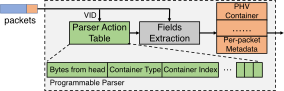
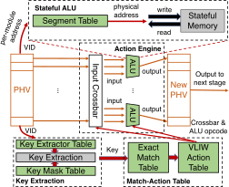
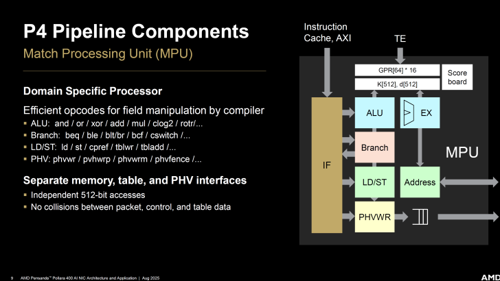
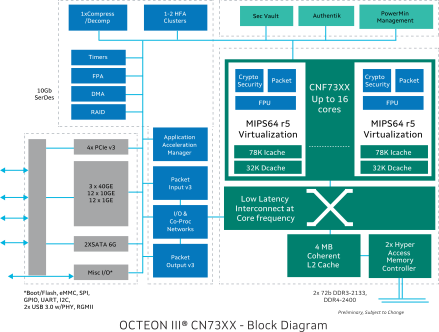
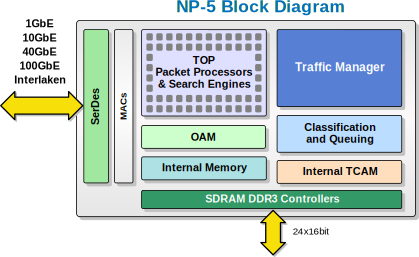
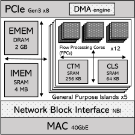
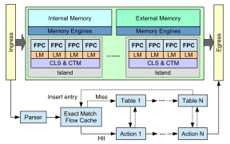
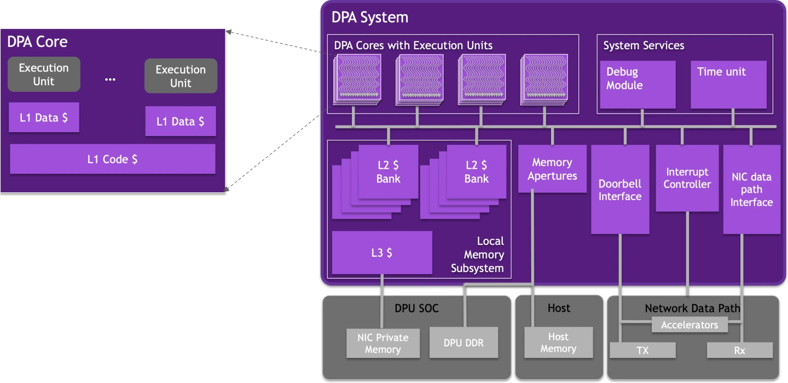

# Chapter 2: Architecture

## RMT 流水线

随着 SDN 网络兴起 OpenFlow 大火(谷歌在骨干网上部署 SDN 取得巨大成功), 而 OpenFlow 在承载 SDN 存在关键弊病: 当时的硬件交换机非常严格，仅允许在一组固定的字段上进行`匹配操作`处理, 无法支持自定义协议的解析。

为了增强交换机的可编程性, RMT(Reconfigurable Match Table) 提出了将 OpenFlow 中 Match-Action 的抽象应用到报文协议解析中，以支持自定义的协议解析。随后报文经过一系列匹配阶段, 根据解析结果特定字段执行对应的处理程序。

### 解析器
解析器通过 match-action 逐步提取报文的头部字段并循环压入并输出包头向量(PHV, Packet Header Vector), 实现协议解析。用户可通过配置不同的 match-action 表项实现自定义的协议字段提取。

包头向量由一组头字段组成，如IP dest、Ethernet dest等。此外，包头向量包括“元数据”字段，如VLAN ID, 包到达的输入端口编号和其他路由器状态变量(例如，路由器队列的当前大小)。

### 逻辑匹配阶段
逻辑匹配阶段接受解析器生成的包头向量, 提取用于匹配规则的关键字(Table Engine, TE)。随后根据`关键字匹配的结果`或`关键字的哈希`, 加载并执行相应的 Action 程序(Match Process Unit, MPU)。

MPU 是专门面向数据流处理设计的核心, 支持各种复杂的操作。一段 Action 程序包含了若干条指令，包括对 PHV 的修改、常见的算术逻辑运算、访存指令, 以及位域操作加速指令等。

  

## 多核与共享内存
基于流水线的 RMT 显著简化了布线设计, 但存在两个重要问题:
1. 流水线每一级的表存储器是局部专用的，这意味着某一级未使用的存储器无法被另一级复用。
2. RMT 硬连线规定数据包在流水线级间传输时必须先执行匹配操作再执行动作操作, 缺乏灵活性。

因此，使用一个全局的存储器，并通过片上网络(例如交叉开关)将其与逻辑匹配核心相连接是更合适的。此外, 使用一组匹配动作处理器, 而不是顺序将其连接起来。调度器根据一些策略，将数据包发送至处理器上。数据包将驻留在这个处理器上运行完整程序直至被处理完成后接收下一个数据包, 被称为`运行至完成`处理模型。

这种设计能够带来相当多的好处:
1. 编译器更易设计。而流水线的结构导致编译器需要进行静态调度和放置, 同时考虑到程序操作之间的依赖关系。
2. 存储与计算相互解耦, 从而允许以任意顺序执行匹配动作操作, 而不是像流水线那样固定顺序。
3. 共享复用大大提高了片上存储器的使用效率。

然而，这种`运行至完成`处理模型可能无法保证数据包的确定性和延迟(e.g. 缓存未命中、总线争用、Bank冲突), 因此调度和内存系统的设计至关重要, 以尽可能避免争用情况的发生, 例如使用静态的处理结构、基于静态编译的调度、使用静态片上内存而不是高速缓存等。

  

> 这种架构和慢路径通用处理器又有哪些区别? 如何对架构设计进行权衡?

### 包调度器
有时候包调度器也被称为 Traffic Manager。与 RMT 流水线中的解析器类似, 其将输入的报文头部解码为包头向量, 并且需要根据向量信息，将报文分发到合适的地方进行处理。如调度器需要管理连接状态表（QP Context Table），根据报文所属连接分发到管理对应连接的网络处理核心或核心集群。  
其他的影响因素还有包的优先级, 负载均衡, 硬件状态(减小争用)等等。包调度器也可以选择根据一些条件丢弃一些包, 以实现对流量的限速。

#### 可编程队列
<!-- TODO: PIFO, PIEO, SP-PIFO -->

### 网络处理核心
面向数据流处理器，一方面增加了包头向量处理的数据通路和位域操作的加速指令，另一方面为了减少核心在处理报文中的上下文切换开销增加了硬件层面的线程调度支持。

### Example

PANIC 主要分为四个部分:
- RMT 流水线: 一个简单的解析器, 对包进行解析生成描述符头部(Descriptor)，与 Central Scheduler 共同构成 Traffic Manager。如果不需要卸载，包将直接进入 DMA 单元传输至主机。
- 高性能交换网络
- 中央调度器: 监控卸载单元的忙碌情况(Credit Manager), 并结合描述符将包调度到空闲的核心(对于相同服务的数据可以并行卸载), 实现负载均衡和低延迟。
- 计算单元: 可以是固化的加速器逻辑, 也可以是由处理器实现。

> RMT 流水线模块可以根据接收数据包的要求将新的卸载链编程到查找表中。即 RMT 流水线的查找表是可编程的。此外, 变长的头部允许数据经过多个计算单元。

## Case Study
### Netronome Agilio NFP-4000

 

FPC(Flow Processing Cores) 是一个 32 位具有 CRC 硬件加速的 RISC 核心, 主频 800MHz, 具有 8 个线程上下文, 但一次最多只能运行一个线程。虽然 FPC 具有强大的数据流处理能力, 但其代码存储空间较小, 缺少定时器, 并且不支持浮点操作等复杂的计算。

| Memory | Scope | Size | Latency |
|:------:|:-----:|:----:|:-------:|
| Instruction Mem | Core | 32KiB | N/A |
| Local Mem (LM) | Core | 4KiB | 1-3 |
| Cluster Local Scratch (CLS) | Island | 64KiB | 20-50 |
| Cluster Target Mem (CTM) | Island | 256KiB | 50-100 |
| Internal Mem (IMEM) | Global | 4MiB | 150-250 |
| External Mem (EMEM) | Global | 2GiB | 150-250 |

FPC 与指令存储器和五层数据存储器交互，每一层都有其自身的作用域、大小和访问延迟。
具体来说，由于 IMEM 和 EMEM 是全局可用的，我们利用它们来存储所有 FPC 共享的变量，例如锁、计数器和全局状态。FPC 依赖内存引擎 (ME) 来执行读写操作。内存引擎有两种类型：批量内存引擎和原子内存引擎。IMEM 和 EMEM 各自拥有独立的内存引擎。

当一个包到达 Ingress 部分，FPC 线程将进行如下步骤操作:
- 解析存储在 CTM 中的数据包头部，并提取头部字段。
- 查找位于 EMEM 中的精确匹配流缓存 (EMFC)，其中存储着所有已访问的流。
- 如果数据包属于新流，FPC 将执行整个程序，即查找表并执行匹配的操作。于此同时, FPC 将每个表(匹配字段的值, 操作 ID 和相应的参数)中的匹配条目记录下来并添加到 EMFC 。
- 如果数据包头字段在 EMFC 中已经存在, FPC 将跳过所有查找操作, 仅执行已记录的操作。
- 最后 FPC 将包推送至 Egress, 随后处理下一个包。

FPC 同时支持 P4 和 Micro-C 语言编程。FPC 程序与典型的 P4 程序类似, 程序员可以使用 P4 语言定义程序头、解析器和匹配字段; 对于操作, 程序员通常使用 Micro-C 语言以获得更好的灵活性。

### NVIDIA BlueField-3

与 NFP-4000 类似, NVIDIA BF-3 DPA 采用了类似的设计: 大量的面向数据流处理的小型 RISC 核心, 每个核心具备大量的硬件线程上下文管理。

DPA 上装载了一个实时操作系统 (RTOS), 支持多进程和多线程, 每个线程可以通过硬件的调度映射到不同的执行单元从而实现并行执行。这些进程的执行上下文是隔离的，即在各自的地址空间内运行。RTOS 负责在不同进程之间实施特权和隔离。与许多其他实时操作系统（RTOS）一样，用户空间栈的大小有限(8184 Bytes)，用户有责任确保程序不会分配超出栈限制的内存。
RTOS 采用协同运行至完成（cooperative run-to-completion）的调度模型。在协同调度下, 执行处理程序可以在不中断的情况下使用执行单元, 直至其放弃该单元。一旦放弃, 执行单元将交还给 RTOS 以调度下一个处理程序。RTOS 为处理程序设置了一个看门狗, 以防止任何处理程序过度占用执行单元。

| Properties | Value |
|:----------:|:-----:|
| Arch | RV64IMAC |
| Cores | 16 |
| Threads | 256 |
| L1i$ | 1KiBx16 |
| L1d$ | 1KiBx256 |
| L2$ | 1.5MiBx1 |
| LLC | 3MiB |
| Clock | 1.8GHz |

更大的差异体现在内存系统上, DPA 核心采用了多级缓存的设计: DPA 内存访问经过三个级别的缓存。每个执行单元都有一个私有的 L1 数据缓存, 而 L1 代码缓存由 DPA 核心中的所有执行单元共享。L2 缓存由所有 DPA 核心共享。由于每个线程的缓存容量较小，因此程序员需要经过精心的缓存工程, 以保证热点数据和程序命中，减少对性能的影响。

随之引申出来的问题就是缓存一致性: DPA 提供了一个弱一致性内存模型。应用程序需要使用栅栏来强制执行所需的内存顺序。此外，在适用的情况下，应用程序需要将数据写回，以使数据对 NIC 引擎可见。

### AMD Pensendo

## Reference
- Sushant Jain, Alok Kumar, Subhasree Mandal, Joon Ong, Leon Poutievski, Arjun Singh, Subbaiah Venkata, Jim Wanderer, Junlan Zhou, Min Zhu, Jon Zolla, Urs Hölzle, Stephen Stuart, and Amin Vahdat, "B4: experience with a globally-deployed software defined wan", SIGCOMM Comput. Commun. Rev. 43, 4 (October 2013), 3–14. https://doi.org/10.1145/2534169.2486019
- Pat Bosshart, Glen Gibb, Hun-Seok Kim, George Varghese, Nick McKeown, Martin Izzard, Fernando Mujica, and Mark Horowitz, "Forwarding metamorphosis: fast programmable match-action processing in hardware for SDN", SIGCOMM Comput. Commun. Rev. 43, 4 (October 2013), 99–110. https://doi.org/10.1145/2534169.2486011
- Wang, Tao, Xiangrui Yang, Gianni Antichi, Anirudh Sivaraman, and Aurojit Panda, "Isolation Mechanisms for High-Speed Packet-Processing Pipelines", NSDI 22, 1289–305. https://www.usenix.org/conference/nsdi22/presentation/wang-tao.
- Chole, Sharad, Andy Fingerhut, Sha Ma, et al. 2017. "dRMT: Disaggregated Programmable Switching", Proceedings of the Conference of the ACM Special Interest Group on Data Communication (New York, NY, USA), SIGCOMM' 17, August 7, 1–14. https://doi.org/10.1145/3098822.3098823.
- Rajath Shashidhara et al., "FlexTOE: Flexible TCP Offload with Fine-Grained Parallelism", 19th USENIX Symposium on Networked Systems Design and Implementation (NSDI 22), 87-102, https://www.usenix.org/conference/nsdi22/presentation/shashidhara
- Shaoke Xi et al., "Cora: Accelerating Stateful Network Applications with SmartNICs", arxiv, https://arxiv.org/abs/2410.22229
- DPA Development - NVIDIA Docs, https://docs.nvidia.com/doca/sdk/dpa-development/index.html